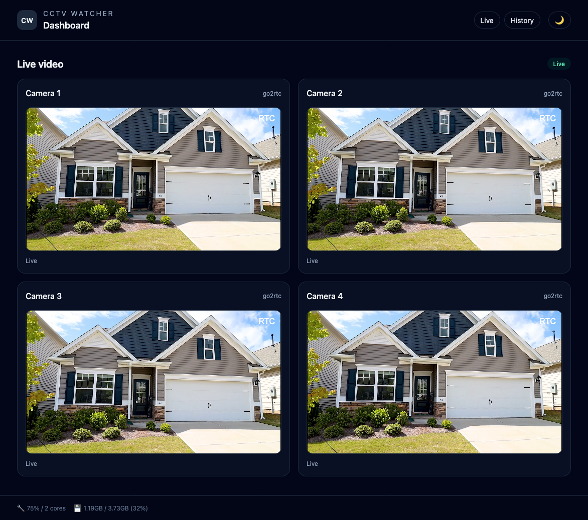
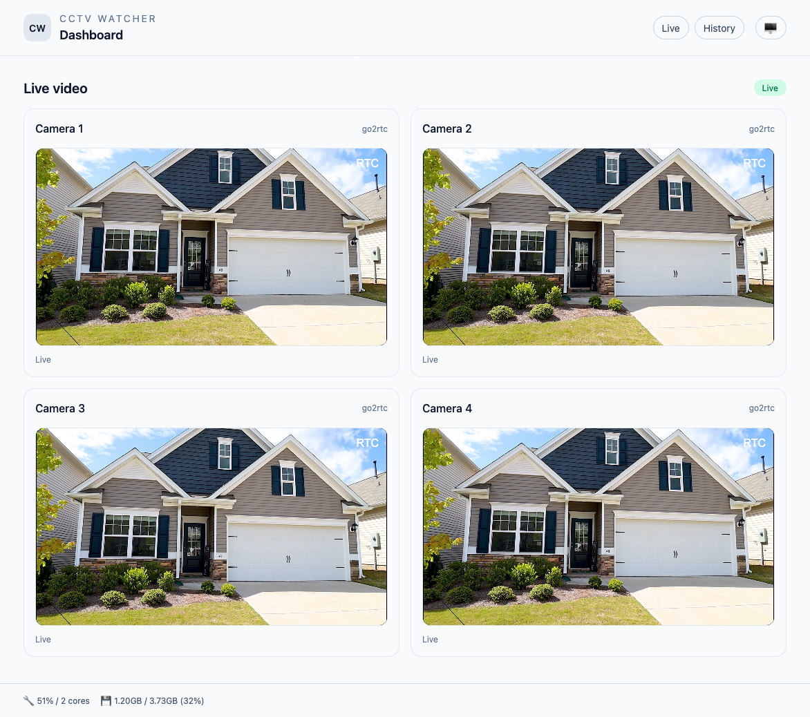
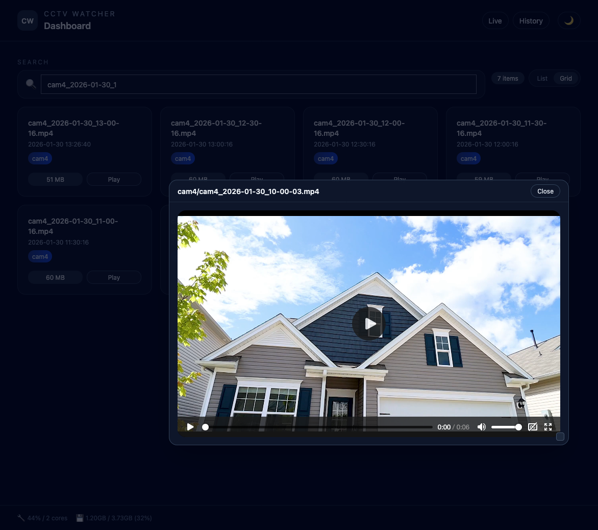
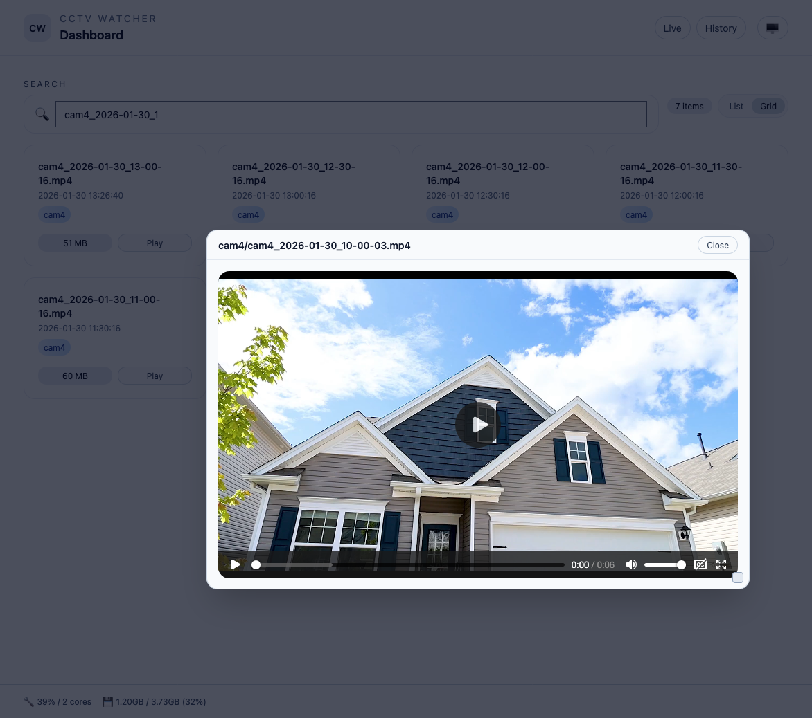

# CCTV Watcher

A lightweight web dashboard for CCTV: live camera streams, an archive of recordings grouped by date, quick search, and real-time CPU/RAM stats in the footer. Designed for simple server deployments with Docker.

## Screenshots

### Live (Dark / Light)

### History (Dark / Light)

# CCTV Server

Ready RTSP recording and playback stack with a web UI.

## Components
- **FFmpeg recorders** — MP4 segment recording.
- **go2rtc** — live streaming gateway.
- **SvelteKit app** — UI (`/` live, `/history` archive).
- **nginx** — reverse proxy + static file delivery from `/recordings`.

## Configuration
1) Copy `.env.example` → `.env` and set:
- `CAMx_URL`, `CAMx_NAME`, `CAMx_RECORDINGS_DIR`
- `GO2RTC_HTTP` (go2rtc base URL, e.g. `/go2rtc`)
- `CAMERA_COUNT` (number of cameras shown in UI)

2) App container env:
- `RECORDINGS_ROOT` (host path where recordings are stored)

## Routes
- `http://WEB_HOST/` — live
- `http://WEB_HOST/history` — archive
- `http://WEB_HOST/recordings/...` — direct media files (nginx alias)

## Run (Docker)
- `docker compose build app`
- `docker compose up -d`

## Live streams (go2rtc)
Configured in [go2rtc.yaml](go2rtc.yaml):
- `cam1: ${CAM1_URL}`
- `cam2: ${CAM2_URL}`
- `cam3: ${CAM3_URL}`
- `cam4: ${CAM4_URL}`

## Basic auth (optional)
Set `AUTH_USER` and `AUTH_PASS_HASH` in app/.env. Generate a bcrypt hash:

- `cd app && node -e "const bcrypt=require('bcryptjs'); bcrypt.hash('your-password', 10).then(h=>console.log(h));"`
